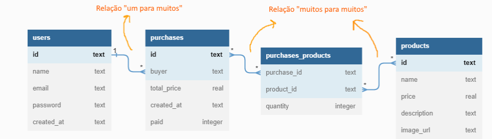

# Labecommerce-backend
#

##

**API para aplicação de gestão de projetos.**

*Aplicação banck-end de servidor express com banco de dados SQL SQlite 3.*

*    *  *  Acesso às informações de Produtos, usuários e Compras relacionadas entre si.

#
Endpoints
Documentação Postman de todos os endpoints.

 Get all users
 Create user
 Create product
 Get all products funcionalidade 1
 Get all products funcionalidade 2
 Edit product by id
 Create purchase
 Delete purchase by id
 Get purchase by id

#
#
## (Visualize a documentação)

https://documenter.getpostman.com/view/24460719/2s935hQSRd

#
## Stack utilizada: Front-end: 
* NodeJS 

* Typescript

* Express

* SQL e SQLite

* Knex

* Postman
#

## Como rodar este projeto?

* Terminal bash
* Clone este repositório
git clone ...link do repo AQUI

* Acesse a pasta do projeto no seu terminal, ex: cd labecommerce-backend

* INSTALE AS DEPENDÊNCIAS: 

* *npm install:*  Instala todas as dependências listadas no package.json;
* *npm i cors:*  biblioteca para liberar acesso externo ao servido;
* *npm i express:*  framework para criar o servidor (API);
* *npm i knex:*  biblioteca query builder para conectar com banco de dados
* *npm i sqlite3:*  biblioteca do banco de dados SQLite
#
## Execute a aplicação

rodar o script de dev (npm run dev) ou rodar ou buildar o (npm run start).

 Servidor rodando na porta  3003. 
#
#

## 🚀 Sobre mim
 *Olá, me chamo Aureana!👋 Eu sou uma pessoa desenvolvedora full-stack, apaixonada por tecnologia!* 😊

 💖💖💖*Designed and built by Aureana with Love & Coffee*💖💖💖
#
#

## 🔗 Links

